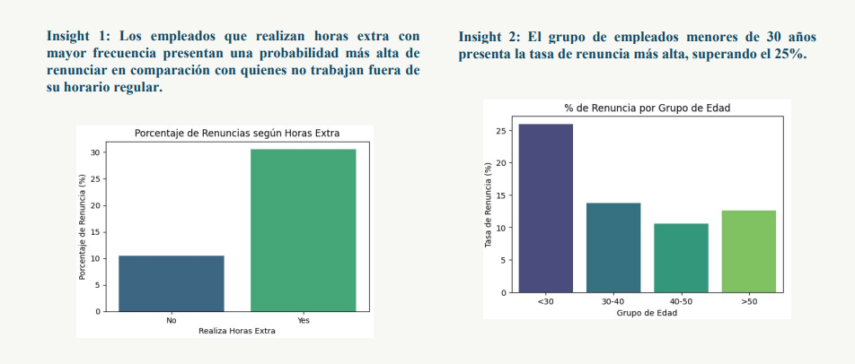
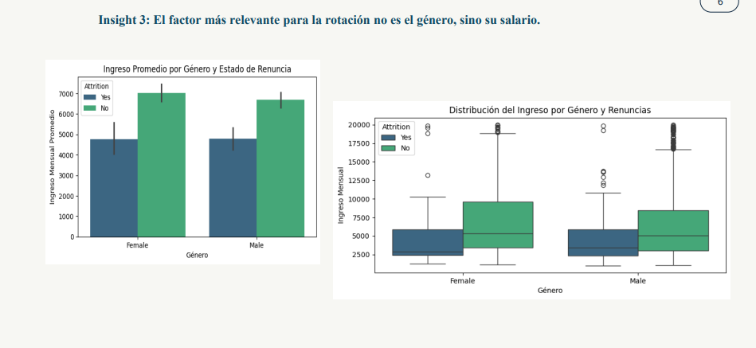
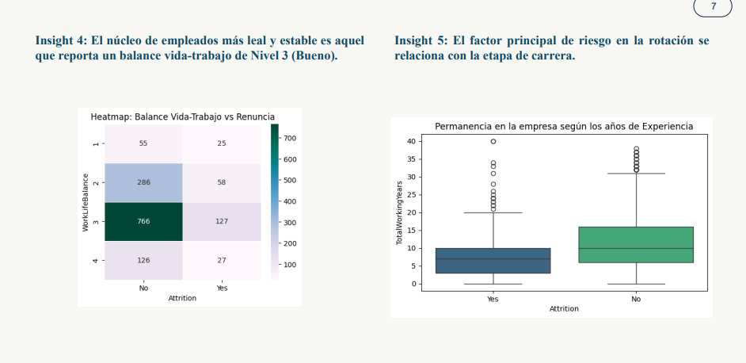

# 📊 Análisis de Rotación Laboral

## 📝 Descripción
Proyecto de análisis de datos orientado a comprender la rotación laboral y los factores que influyen en la permanencia o salida de los empleados. 
Se identificaron patrones clave y se generaron insights relevantes para apoyar la toma de decisiones dentro de la organización.

## 🎯 Objetivos
- Explorar y preparar los datos para análisis estadísticos.  
- Identificar patrones, relaciones entre variables y outliers.  
- Comunicar hallazgos de manera visual y clara mediante gráficos y narrativa analítica.

## 🛠 Herramientas utilizadas
- 🐍 Python: pandas, numpy, matplotlib, seaborn  
- 📓 Jupyter Notebook para análisis interactivo y visualizaciones

## 📈 Visualizaciones destacadas

## 📂 Archivos del proyecto
- [Notebook de análisis](ProyectoPython.ipynb)  
- [Informe en PDF](Informe final.pdf)  
